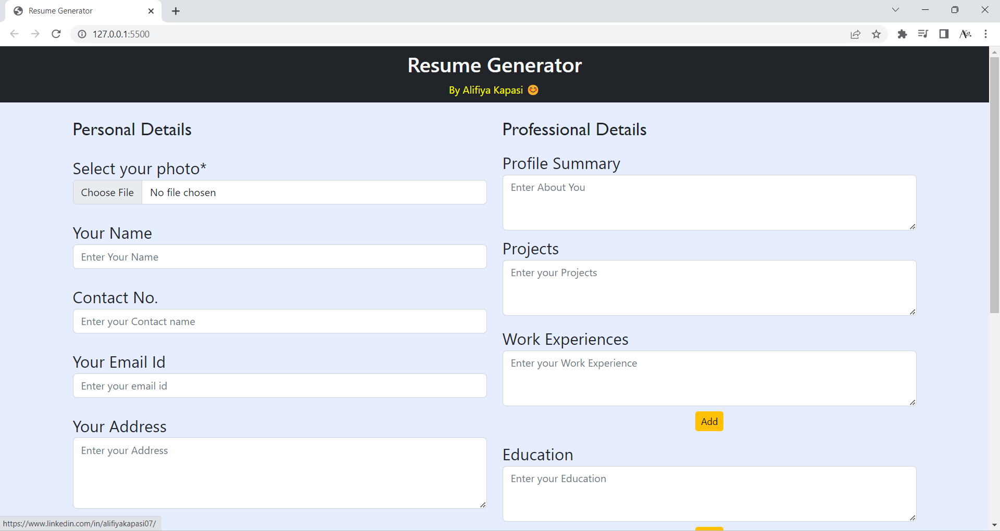
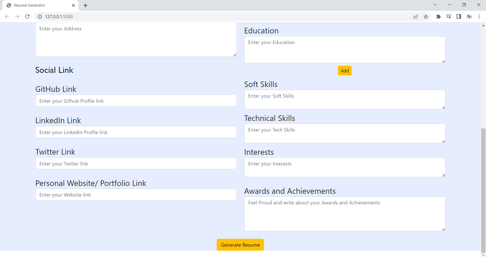
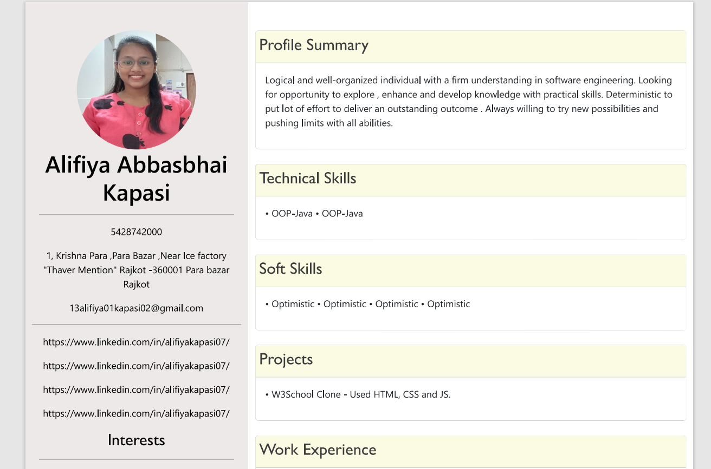

# Resume Generator
> https://alifiyakapasi07.github.io/W3Schools_Clone/

## Website Preview

 

### Final Result will look something like this

## Features 📋
⚡️ Fully Responsive
⚡️ Easy to modify
⚡️ Attractive UI/UX

## Sections 📚
✔️ Personal Details \
✔️ Professional Details\
✔️ Social Link\
✔️ Profile Summary\
✔️ Generate Resume

## Tools Used 🛠️
* <b>GitHub Pages</b> - To host my static website (HTML, CSS, JS).
